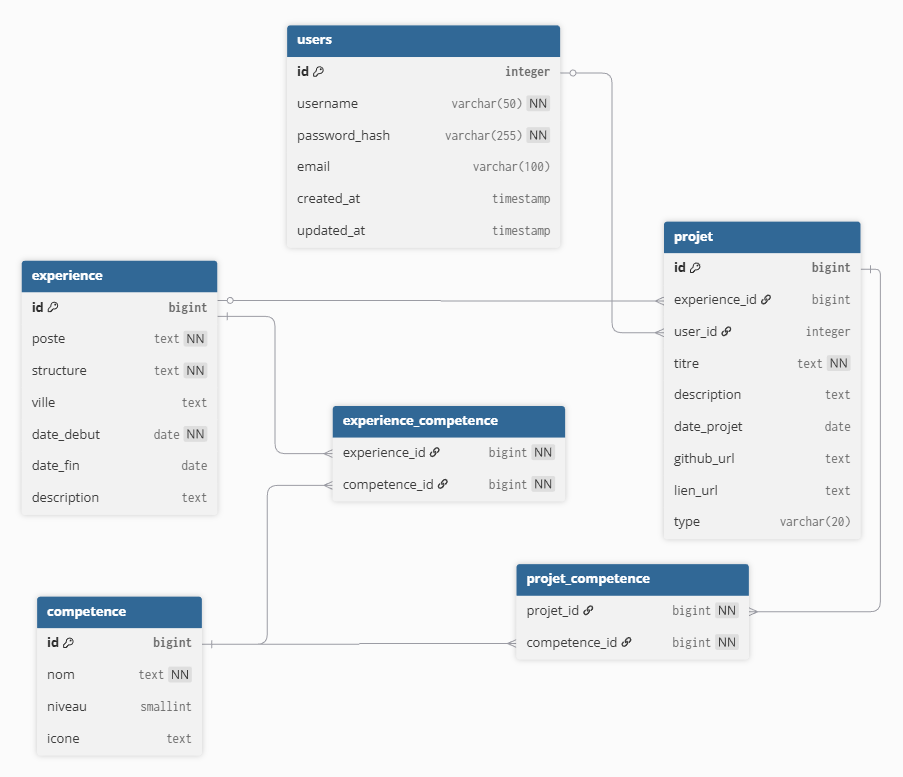

# Fonctionnalites techniques du site

## Frontend (Vue 3 + Vite)

### Cache API cote client

- Objectif: eviter les rechargements complets lors du switch entre Accueil et Projets.
- Implementation: `useApiCache` stocke les reponses par URL avec une clee unique (ex: `/projects/search`).
- Effet: les vues rechargent instantanement apres un passage initial, reduisant les appels HTTP.

### Composables modulaires

- `useProjects`: centralise le fetch des projets, normalise la forme des donnees (champs `title`, `github`, `lien`, `skills`, `user_id`).
- `useFilters`: regroupe la logique de recherche texte, filtre competences, filtre annees et tri.
- `useFormatters`: formatage des dates et petites conversions UI pour garder les composants legers.

### Filtrage avance

- Recherche texte: filtrage par titre/description (cote client sur les donnees deja chargees).
- Multi-competences: filtrage par intersection de competences selectionnees.
- Annees: extraction automatique des annees disponibles a partir des dates projets.
- Tri: asc/desc, applique apres filtrage pour garder un ordre coherent.

### Chargement progressif

- Skeleton loaders affiches pendant les appels API.
- Ameliore la perception de vitesse en remplacant les sauts de layout.

### Composants reutilisables

- `ProjectCard`: affichage standardise des projets (titre, date, description, skills, liens).
- `SkillTag`: badges de competences avec variantes de taille/couleur.
- `FilterPanel`: panneau de filtres repliable pour alleger l'UI.
- `SkillsSection`: presentation regroupee par categories.

### Auth locale

- Stockage local des infos de session via `localStorage` (username, user_id).
- Utilise pour afficher les actions reservees (creation, suppression).
- Les routes restent accessibles, mais les boutons sont conditionnes a l'etat de session.

## Backend (FastAPI)

### Aggregation SQL

- Requetes projets retournent les competences via `array_agg`.
- Permet de restituer les projects avec leurs skills en un seul appel.

### Validation Pydantic

- Modeles pour login, contact, creation projet.
- Evite les payloads incomplets et force un format stable.

### Suppression securisee

- Verification proprietaire cote serveur avant suppression.
- Refus si l'utilisateur ne correspond pas au `user_id` du projet.

### Contact avec fallback

- Si MongoDB est disponible: enregistrement direct dans la base.
- Sinon: sauvegarde JSON locale pour ne pas perdre les messages.
- Possibilité d'amélioration: synchronisation automatique des messages sauvegardes vers MongoDB une fois disponible.
- Par defaut, par manque de temps, nous nous sommes focalises sur la partie PostgreSQL.

## UX / UI

### Navigation et routing

- SPA avec `vue-router` pour des transitions rapides sans rechargement.
- Boutons et routes claires pour Accueil, Projets, Login, Creation.

### Feedback utilisateur

- Messages success/erreur sur les formulaires.
- Validation des champs requis avant envoi.
- Etats de chargement visibles (boutons disables, label "En cours...").

### Actions conditionnelles

- Boutons de creation/suppression visibles uniquement si session valide.
- Evite d'exposer des actions inutiles aux visiteurs.

